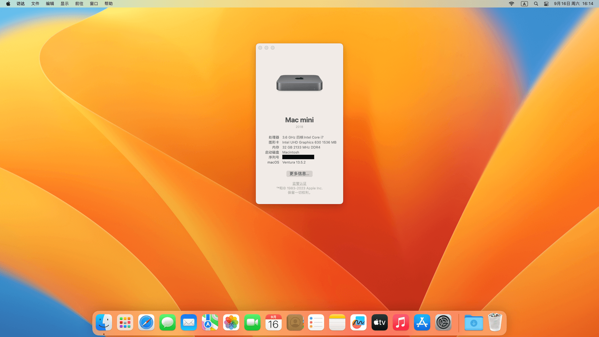

# Deskmini-110-Hackintosh-Ventura

Hackintosh EFI files for Deskmini 110

| Hardware         | Specs                 |
| ---------------- | --------------------- |
| Motherboard      | ASRock H110M-STX/COM  |
| CPU              | Intel i3-8100         |
| Graphics         | UHD 630               |
| RAM              | 16GB DDR4 * 2         |
| Hard Drive       | Predator GM7 2TB Nvme |
| WIFI / Bluetooth | DW1560                |

## Working

- ✅ Graphics
- ✅ Audio
- ✅ WiFi (2.4G & 5G) / Ethernet
- ✅ Bluetooth
- ✅ USB 2.0 & 3.0
- ✅ AirDrop
- ✅ Sleep / Wake

## Not Working

- VGA port output

